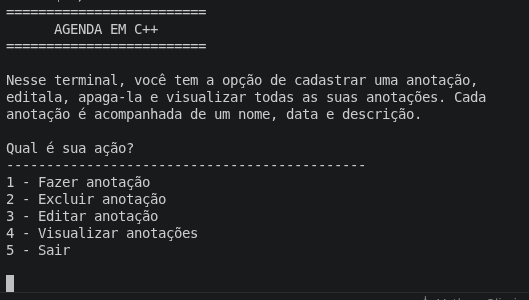
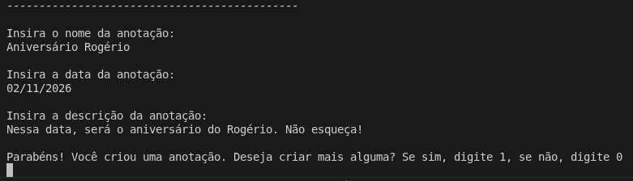
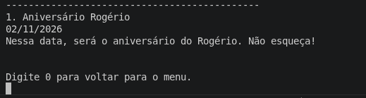

# 📕 Notes Manager C++
> 📚 Projeto desenvolvido para fins de estudo e prática da linguagem C++.


Um sistema simples de gerenciamento de anotações desenvolvido em C++ para praticar conceitos fundamentais da linguagem, como `struct`, `std::vector`, `std::string` e modularização com funções.

Desenvolvi este projeto para consolidar meus conhecimentos em C++, aplicando na prática os conceitos aprendidos na disciplina de Fundamentos de Programação (FUP) da faculdade e construindo meu primeiro sistema completo.

> ⚠️ **Atenção**
>
> O sistema pode entrar em loop infinito se forem inseridos caracteres não numéricos em campos que exigem apenas números.
> Use apenas entradas válidas para evitar travamentos.


## 📷 Demonstração








## ✨ Funcionalidades

* ✅ Criar anotações
* ✏️ Editar anotações
* ❌ Excluir anotações
* 👀 Visualizar todas as anotações

Cada anotação possui:

* Nome
* Data
* Descrição


## ⚒️ Tecnologias Utilizadas

- C++
- Standard Template Library (STL)

## 📂 Estrutura do projeto

```
NotesManager/
│
├── src/
│   └── main.cpp
│
├── README.md
├── LICENSE
└── .gitignore
```

## 🚀 Como executar

Clone o repositório:

```bash
git clone https://github.com/MatheusAlmeida-Oliveira/NotesManager.git
```

Entre na pasta:

```bash
cd NotesManager
```

Compile:

```bash
g++ src/main.cpp -o notes
```

Execute:

### Linux

```bash
./notes
```

### Windows

```bash
notes.exe
```

## 🎯 Objetivo do projeto

Este é meu primeiro projeto desenvolvido, com o objetivo de praticar:

- Estruturas (`struct`)
- Vetores (`std::vector`)
- Strings (`std::string`)
- Passagem por referência
- Modularização com funções
- Manipulação de entrada do usuário
- Operações CRUD em memória
- Operações com git

## 📌 Possíveis melhorias futuras

- [ ] Salvar as anotações em arquivo
- [ ] Buscar anotações pelo nome
- [ ] Ordenar anotações por data
- [ ] Melhorar a interface do terminal
- [ ] Dividir o projeto em múltiplos arquivos (`.cpp` e `.h`)

## 👨‍💻 Autor

Desenvolvido por **Matheus Almeida**.


